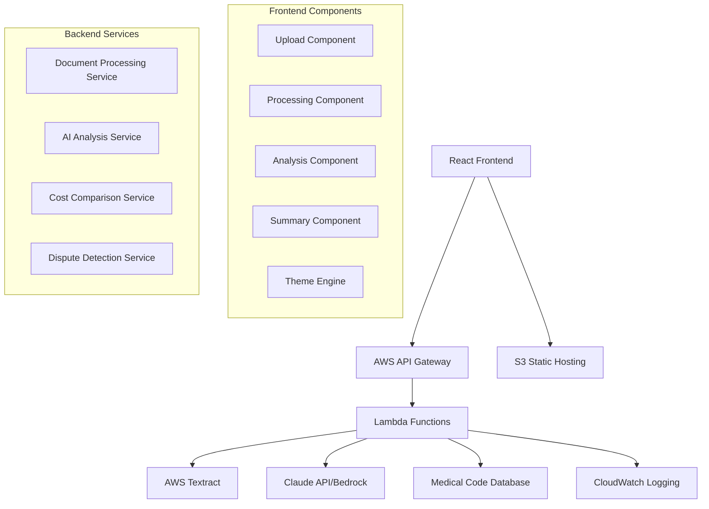

# WTFee (What The Fee) - Design Document

## Overview

WTFee is a React-based web application that demystifies medical bills through AI-powered analysis and an emotionally intelligent user interface. The application processes uploaded medical bills using AWS Textract for OCR, leverages Claude API for plain-English explanations, and features a unique UI that transforms from anxiety-inducing to calming as users gain understanding of their charges.

The core innovation lies in the haunting-to-healing journey mapping - the interface literally exorcises its own demons as the user conquers their medical bill monster. The experience transforms from genuinely unsettling (reflecting the real horror of medical bills) to therapeutically peaceful, making the journey both emotionally authentic and visually stunning for the Kiroween Costume Contest.

## Architecture

### High-Level Architecture



### Technology Stack

**Frontend:**
- React 18 with TypeScript for type safety
- Styled Components for dynamic theming and emotional UI transitions
- Framer Motion for smooth animations and theme transitions
- React Query for state management and API caching
- React Dropzone for file upload handling

**Backend:**
- AWS Lambda for serverless compute
- AWS API Gateway for REST API endpoints
- AWS Textract for document OCR and data extraction
- Claude API (Anthropic) or AWS Bedrock for AI explanations
- AWS S3 for temporary file storage (with automatic cleanup)

**Infrastructure:**
- AWS CloudFormation or CDK for infrastructure as code
- AWS CloudWatch for monitoring and logging
- AWS WAF for security protection
- CloudFront CDN for global performance

## Haunting Visual Effects System

### The Curse Metaphor
The medical bill is treated as a cursed document that haunts the interface. As users understand each line item, they're literally "exorcising" the demons from their bill, and the haunting effects fade proportionally.

### Haunting Effects by State

#### Haunted State (Initial Bill Upload)
- **Fog/Mist Background**: Subtle animated fog that drifts across the interface
- **Flickering Elements**: Text and borders that subtly flicker like unstable electricity
- **Parchment Texture**: The bill appears on aged, yellowed parchment with torn edges
- **Ominous Glow**: Red/orange glow around the total amount, pulsing like a heartbeat
- **Ghost Shapes**: Barely visible, translucent shapes that drift in the background
- **Watching Shadows**: Shadows that seem to move independently, creating unease
- **Unsettling Typography**: Slightly irregular letter spacing, subtle text distortion
- **Cursed Document Effects**: The bill itself appears weathered, with ink that seems to bleed

#### Processing State (Analyzing the Curse)
- **Exorcism in Progress**: Fog begins to clear in analyzed sections
- **Flickering Stabilizes**: Elements stop flickering as they're explained
- **Light Breaking Through**: Warm light begins to penetrate the darkness
- **Ghost Shapes Fade**: Supernatural elements become less prominent
- **Shadows Retreat**: Dark shadows pull back from explained sections

#### Understanding State (Curse Weakening)
- **Clearing Atmosphere**: Most fog has dissipated, only lingering around unexplained items
- **Stable Elements**: Flickering has mostly stopped
- **Natural Colors**: Haunting reds/oranges transition to calmer blues/greens
- **Readable Typography**: Text becomes clean and professional
- **Peaceful Shadows**: Shadows become natural and supportive rather than ominous

#### Relieved State (Curse Lifted)
- **Clear Atmosphere**: All supernatural effects have faded
- **Warm, Natural Lighting**: Soft, welcoming colors throughout
- **Clean Design**: Professional, medical-grade clean interface
- **Confident Typography**: Clear, readable, trustworthy fonts
- **Supportive Shadows**: Gentle shadows that enhance readability

### Technical Implementation of Haunting Effects

```typescript
interface HauntingEffects {
  fogAnimation: {
    opacity: number;
    movement: 'drift' | 'swirl' | 'fade';
    speed: number;
  };
  flickerEffect: {
    elements: string[];
    intensity: number;
    frequency: number;
  };
  ghostShapes: {
    count: number;
    opacity: number;
    movement: 'float' | 'drift' | 'fade';
  };
  shadowBehavior: {
    movement: boolean;
    intensity: number;
    color: string;
  };
  documentCurse: {
    parchmentTexture: boolean;
    glowIntensity: number;
    edgeDistortion: number;
  };
}
```

### Accessibility Considerations for Haunting Effects
- **Reduced Motion**: All supernatural animations respect `prefers-reduced-motion`
- **Photosensitivity**: Flickering effects are subtle and can be disabled
- **Color Contrast**: Even in haunted state, text maintains WCAG AA compliance
- **Screen Readers**: Haunting effects are purely visual, don't interfere with screen readers
- **Cognitive Load**: Effects enhance rather than distract from core functionality

## Components and Interfaces

### Frontend Components

#### 1. Upload Component (`UploadZone`)
```typescript
interface UploadZoneProps {
  onFileUpload: (file: File) => void;
  isProcessing: boolean;
  emotionalState: EmotionalState;
}

enum EmotionalState {
  HAUNTED = 'haunted',           // The cursed bill appears
  PROCESSING = 'processing',     // Exorcising the billing demons
  UNDERSTANDING = 'understanding', // Light breaking through the darkness
  RELIEVED = 'relieved'          // Peaceful, curse lifted
}
```

**Responsibilities:**
- Handle drag-and-drop file uploads with haunting visual feedback
- Validate file types and sizes with eerie error states
- Display upload progress with supernatural theming (pulsing shadows, fog effects)
- Transform uploaded bill into a "cursed document" with parchment texture and ominous glow
- Provide clear error messages with haunting but not overwhelming visual cues

#### 2. Theme Engine (`EmotionalThemeProvider`)
```typescript
interface ThemeState {
  colors: {
    primary: string;
    background: string;
    text: string;
    accent: string;
    fog: string;
    glow: string;
  };
  typography: {
    fontFamily: string;
    fontWeight: number;
    letterSpacing: string;
    textShadow: string;
  };
  spacing: {
    borderRadius: number;
    shadows: string[];
  };
  animations: {
    duration: number;
    easing: string;
    flicker: boolean;
    float: boolean;
  };
  effects: {
    fogOpacity: number;
    glowIntensity: number;
    shadowMovement: boolean;
    ghostShapes: boolean;
    parchmentTexture: boolean;
  };
}

interface EmotionalTheme {
  haunted: ThemeState;      // The cursed bill state
  processing: ThemeState;   // Exorcising the demons
  understanding: ThemeState; // Light breaking through
  relieved: ThemeState;     // Peaceful resolution
}
```

**Responsibilities:**
- Manage haunting-to-peaceful emotional state transitions
- Orchestrate spooky visual effects (fog, flickering, ghost shapes)
- Control the "exorcism" of haunting elements as understanding grows
- Provide theme values with haunting effects to all components
- Handle smooth supernatural-to-natural transitions
- Respect user accessibility preferences (reduced motion, reduced effects)

#### 3. Bill Analysis Component (`BillAnalysis`)
```typescript
interface LineItem {
  id: string;
  code: string;
  description: string;
  amount: number;
  explanation?: string;
  disputeFlag?: DisputeFlag;
  confidence: number;
}

interface DisputeFlag {
  type: 'overcharge' | 'duplicate' | 'unbundled' | 'error';
  severity: 'low' | 'medium' | 'high';
  explanation: string;
  potentialSavings: number;
}
```

**Responsibilities:**
- Display extracted line items with progressive disclosure
- Show AI explanations with loading states
- Highlight disputed charges with clear visual indicators
- Provide expandable details for complex charges

#### 4. Summary Component (`BillSummary`)
```typescript
interface BillSummary {
  totalCharges: number;
  disputedAmount: number;
  confidenceScore: number;
  nextSteps: ActionItem[];
  downloadOptions: DownloadOption[];
}

interface ActionItem {
  title: string;
  description: string;
  priority: 'high' | 'medium' | 'low';
  contactInfo?: ContactInfo;
}
```

### Backend Services

#### 1. Document Processing Service
```typescript
interface DocumentProcessingRequest {
  fileKey: string;
  fileType: 'image' | 'pdf';
}

interface DocumentProcessingResponse {
  lineItems: ExtractedLineItem[];
  metadata: DocumentMetadata;
  confidence: number;
}

interface ExtractedLineItem {
  rawText: string;
  code?: string;
  description?: string;
  amount?: number;
  boundingBox: BoundingBox;
}
```

**Responsibilities:**
- Invoke AWS Textract for OCR processing
- Parse and structure extracted text into line items
- Identify medical codes, descriptions, and amounts
- Handle various bill formats and layouts

#### 2. AI Analysis Service
```typescript
interface AnalysisRequest {
  lineItems: ExtractedLineItem[];
  context: BillContext;
}

interface AnalysisResponse {
  explanations: LineItemExplanation[];
  overallSummary: string;
  confidenceScore: number;
}

interface LineItemExplanation {
  lineItemId: string;
  plainEnglish: string;
  medicalContext: string;
  costContext: string;
  disputeAnalysis?: DisputeAnalysis;
}
```

**Responsibilities:**
- Generate plain-English explanations using Claude API
- Provide medical context for procedures and codes
- Analyze cost reasonableness
- Identify potential billing errors or overcharges

#### 3. Cost Comparison Service
```typescript
interface CostComparisonRequest {
  procedureCode: string;
  amount: number;
  location?: string;
  facilityType?: string;
}

interface CostComparisonResponse {
  averageCost: number;
  costRange: {
    low: number;
    high: number;
  };
  percentile: number;
  disputeRecommendation: boolean;
}
```

**Responsibilities:**
- Compare charges against regional averages
- Identify outlier pricing
- Provide dispute recommendations
- Source data from healthcare cost databases

## Data Models

### Core Data Models

#### Bill Document
```typescript
interface BillDocument {
  id: string;
  uploadedAt: Date;
  fileType: 'image' | 'pdf';
  processingStatus: ProcessingStatus;
  lineItems: LineItem[];
  summary: BillSummary;
  emotionalJourney: EmotionalJourneyState[];
}

enum ProcessingStatus {
  UPLOADED = 'uploaded',
  EXTRACTING = 'extracting',
  ANALYZING = 'analyzing',
  COMPLETE = 'complete',
  ERROR = 'error'
}
```

#### Emotional Journey State
```typescript
interface EmotionalJourneyState {
  timestamp: Date;
  state: EmotionalState;
  trigger: string;
  progressPercentage: number;
}
```

### API Contracts

#### Upload Endpoint
```typescript
POST /api/bills/upload
Content-Type: multipart/form-data

Response: {
  billId: string;
  uploadUrl: string;
  processingStatus: ProcessingStatus;
}
```

#### Analysis Status Endpoint
```typescript
GET /api/bills/{billId}/status

Response: {
  billId: string;
  status: ProcessingStatus;
  progress: number;
  lineItemsProcessed: number;
  totalLineItems: number;
}
```

#### Analysis Results Endpoint
```typescript
GET /api/bills/{billId}/analysis

Response: {
  billId: string;
  lineItems: LineItemWithExplanation[];
  summary: BillSummary;
  disputeRecommendations: DisputeRecommendation[];
}
```

## Error Handling

### Frontend Error Handling
- **Upload Errors**: Clear messaging for file type, size, or network issues
- **Processing Errors**: Graceful degradation with retry options
- **API Errors**: User-friendly error messages with suggested actions
- **Network Errors**: Offline detection with retry mechanisms

### Backend Error Handling
- **Textract Failures**: Fallback to manual entry suggestions
- **AI Service Errors**: Graceful degradation with basic explanations
- **Rate Limiting**: Queue management with user notifications
- **Data Validation**: Comprehensive input validation and sanitization

### Error Recovery Strategies
```typescript
interface ErrorRecoveryStrategy {
  errorType: string;
  retryAttempts: number;
  fallbackAction: string;
  userMessage: string;
}

const errorStrategies: ErrorRecoveryStrategy[] = [
  {
    errorType: 'TEXTRACT_FAILED',
    retryAttempts: 2,
    fallbackAction: 'SUGGEST_MANUAL_ENTRY',
    userMessage: 'We had trouble reading your bill. Try uploading a clearer image or enter the details manually.'
  },
  {
    errorType: 'AI_SERVICE_UNAVAILABLE',
    retryAttempts: 3,
    fallbackAction: 'BASIC_EXPLANATIONS',
    userMessage: 'Our AI service is temporarily unavailable. We\'ll provide basic explanations for now.'
  }
];
```

## Testing Strategy

### Frontend Testing
- **Unit Tests**: Jest and React Testing Library for component logic
- **Integration Tests**: Testing emotional state transitions and API interactions
- **Visual Regression Tests**: Ensuring UI transformations work across devices
- **Accessibility Tests**: Automated a11y testing with jest-axe
- **Performance Tests**: Lighthouse CI for performance monitoring

### Backend Testing
- **Unit Tests**: Jest for individual service functions
- **Integration Tests**: Testing AWS service integrations with localstack
- **Load Tests**: Artillery.js for API endpoint performance
- **Security Tests**: OWASP ZAP for vulnerability scanning
- **End-to-End Tests**: Playwright for full user journey testing

### Test Data Strategy
- **Synthetic Bills**: Generated test bills with known line items
- **Anonymized Real Bills**: Scrubbed real bills for edge case testing
- **Error Scenarios**: Malformed documents and edge cases
- **Performance Data**: Large bills for performance testing

### Testing Environments
- **Local Development**: Docker compose with mock AWS services
- **Staging**: Full AWS environment with test data
- **Production**: Canary deployments with real user monitoring

## Security Considerations

### Data Protection
- **Encryption in Transit**: TLS 1.3 for all API communications
- **Encryption at Rest**: AES-256 encryption for temporary file storage
- **Data Retention**: Automatic deletion of uploaded files after 24 hours
- **PII Handling**: No permanent storage of personal health information

### Access Control
- **API Security**: Rate limiting and request validation
- **CORS Configuration**: Strict origin policies
- **Input Validation**: Comprehensive sanitization of all inputs
- **File Upload Security**: Virus scanning and file type validation

### Compliance
- **HIPAA Considerations**: Privacy-by-design architecture
- **GDPR Compliance**: Right to deletion and data portability
- **SOC 2 Type II**: Security controls documentation
- **Audit Logging**: Comprehensive activity logging for compliance

## Performance Optimization

### Frontend Performance
- **Code Splitting**: Lazy loading of analysis components
- **Image Optimization**: WebP format with fallbacks
- **Caching Strategy**: Service worker for offline functionality
- **Bundle Optimization**: Tree shaking and minification

### Backend Performance
- **Lambda Optimization**: Provisioned concurrency for critical functions
- **Caching**: Redis for frequently accessed medical code data
- **Database Optimization**: Efficient queries and indexing
- **CDN Strategy**: CloudFront for global content delivery

### Monitoring and Observability
- **Real User Monitoring**: Core Web Vitals tracking
- **Error Tracking**: Sentry for error monitoring and alerting
- **Performance Metrics**: Custom CloudWatch dashboards
- **User Analytics**: Privacy-focused analytics for UX optimization